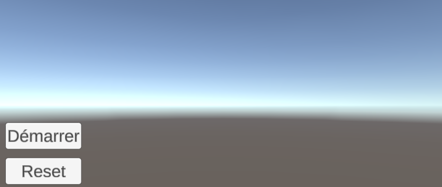

# TIA - Projet Réalité Augmentée

## Concept initial :
- Faire une machine de rube goldberg
- Pouvoir positionner et rotater des pièces pour compléter la machine

## Application développée :
- Machine de rube goldberg
    - Un parcours autour d'une tour + animation de fin (petit feux d'artifices)
    - 4 objets à placer (angle, 2 planche, plaque bondissante), chacun a son image target, règlage de la position et rotation
    - Convoyeur activable par le passage la balle du joueur
    - Des plateformes rebondissantes
    - Interface de démarrage/remise à zéro, de placement d'objet, de fin de partie (nombre de remise à zéro, temps de jeu, nombre d'objets utilisés)

## Manuel utilisateur :
Objectif du jeu :
- Compléter le parcours afin de permettre à la balle rouge d'atteindre l'intérieur de la tour centrale.
- Deux modes de jeu disponibles :
    - Facile : les emplacements des objets à placer sont indiqués en jaune transparant
    - Difficile : les emplacements des objets à placer ne sont pas indiqués

Aides :
- Bouton ``Démarrer`` pour démarrer la partie
- Bouton ``Reset`` pour recommencer la partie

- Pour poser un objet :
    - Positionner au préalable une image target ``VuforiaMars_Images`` visible à travers la caméra :
        - ``Oxygen`` : Plateforme rebondissante
        - ``Fissure`` : Planche/Plateforme
        - ``Drone`` : Coin/Angle
    
    - Sélectionner l'objet virtuel visible sur l'image target
    - Sélectionner le mode de placement avec le bouton central en haut: ``Rotation``, ``Position``. Le mode en cours est indiqué en dessous du bouton
    
    
    - Modifier la position ou rotation sur les 3 axes (x, y, z) à l'aide des 3 glissières en bas à droite
    - Appuyer sur ``Ajouter``, en haut à gauche, pour fixer l'objet à son emplacement actuel
    - Appuyer sur la croix, en haut à droite, pour annuler la sélection de l'objet
- Le résumer de la partie s'affiche lorsque le parcours est complété et comprend :
    - Le nombre de reset
    - Le temps total de jeu
    - Le nombre d'objets utilisés
    